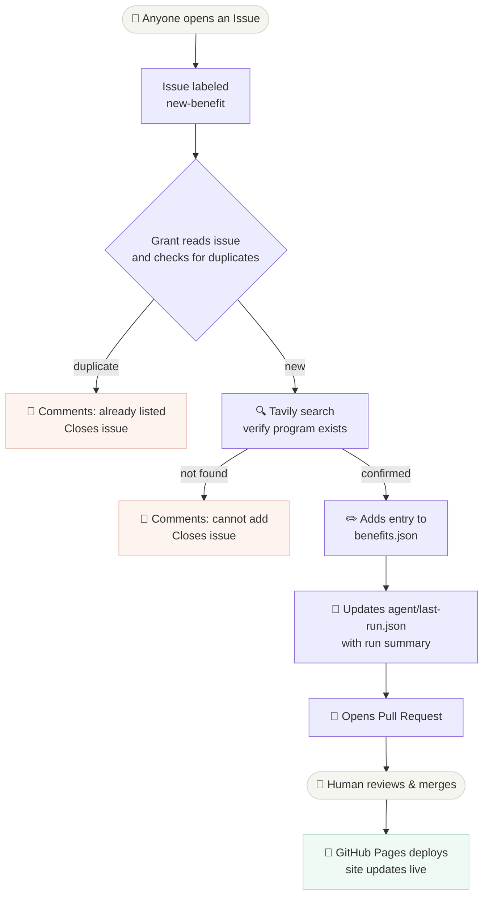

# Student Benefits Hub

[](https://github.com/student-benefits/student-benefits.github.io/actions/workflows/deploy.yml)

A community directory of student discounts, free tiers, and perks — curated by **Grant**, an AI agent. **[→ student-benefits.github.io](https://student-benefits.github.io)**

---

## How it works

Submissions come in as GitHub Issues. Grant — an AI agent running on Claude Sonnet 4 — picks them up, validates them against live web data, and opens a pull request if the benefit checks out. A human reviews and merges. The site deploys automatically.



The full workflow lives in [`.github/workflows/add-benefit.md`](.github/workflows/add-benefit.md) — a Markdown file with a YAML frontmatter block that configures the agent (model, tools, network access, safe outputs) and a plain-English prompt that tells it what to do.

---

## Grant

Grant is the AI agent that maintains this directory. The name is intentional — a grant is literally a student benefit.

| | |
|---|---|
| **Model** | Claude Sonnet 4 (via GitHub Copilot) |
| **Trigger** | GitHub Issue labeled `new-benefit` |
| **Tools** | GitHub API · Tavily web search · web-fetch · file edit |
| **Outputs** | PR with `benefits.json` + `agent/last-run.json` |
| **Safety** | `safe-outputs` allowlist — can only comment, open PRs, close issues |

Every run writes a structured summary to `agent/last-run.json`. The **[/agent/](https://student-benefits.github.io/agent/)** page renders it as an x-ray of the most recent execution — educational if you're curious how AI agents work.

---

## Contributing

**Submit a benefit** — no coding required:

1. [Open an issue](https://github.com/student-benefits/student-benefits.github.io/issues/new?template=new-benefit.yml) with the benefit name
2. Grant validates and opens a PR within minutes
3. A maintainer reviews and merges

**Add benefits directly** — edit `benefits.json` following the schema below and open a PR.

**Improve Grant** — edit `.github/workflows/add-benefit.md` and run `gh aw compile` to regenerate the lock file.

---

## Schema

All data lives in `benefits.json`. Each entry:

```json
{
  "id": "url-safe-id",
  "name": "Official Product Name",
  "category": "one of the valid categories",
  "description": "What students get — specific, max 120 chars",
  "link": "https://direct-url-to-student-signup-page",
  "tags": ["Tag1", "Tag2"],
  "popularity": 5,
  "repo": "owner/repo"
}
```

| Field | Rules |
|---|---|
| `id` | Lowercase, hyphens only, unique |
| `category` | Must be exactly: `AI Tools` · `Dev Tools` · `Cloud & Hosting` · `Learning` · `Design` · `Productivity` · `Lifestyle` · `Domains & Security` |
| `description` | Specific about what students get (e.g. "Free Pro plan for 1 year"); max 120 chars |
| `popularity` | Integer 1–10; default 5 for new entries |
| `repo` | Optional; only for open-source projects |

---

## License

MIT
